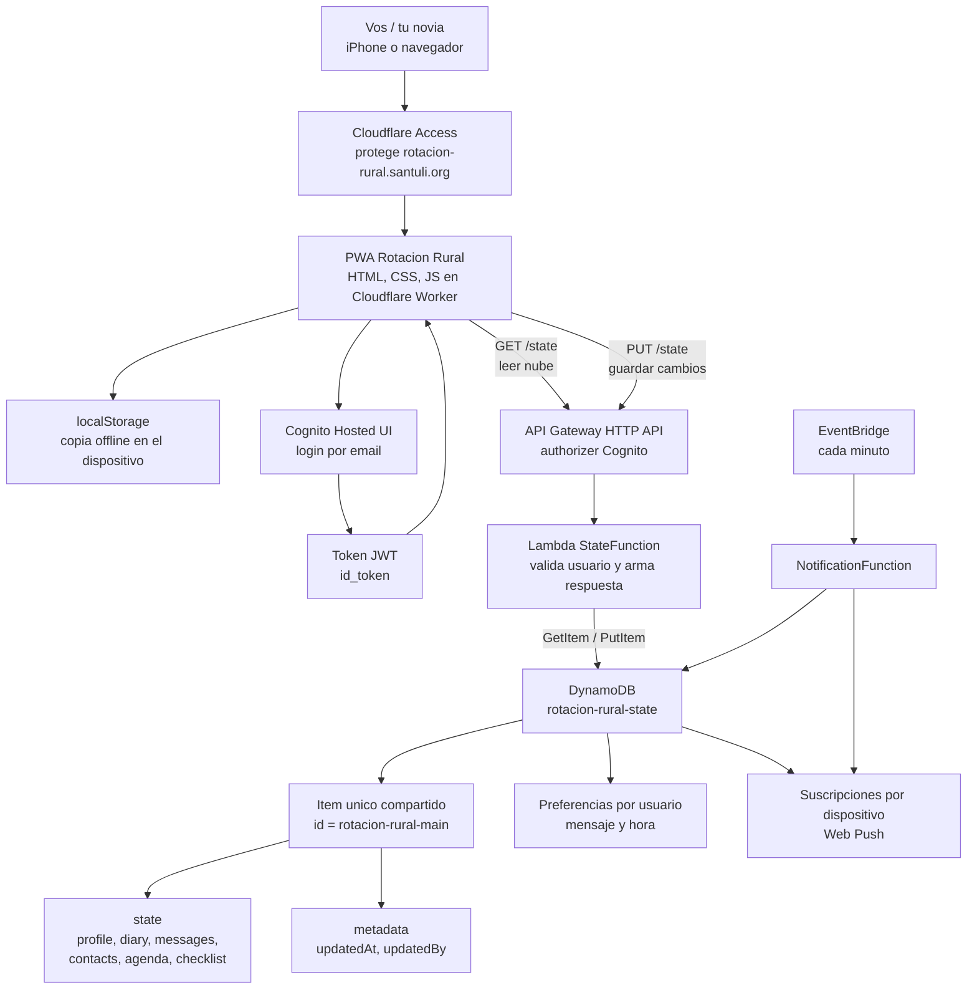

# Base de datos AWS

La app usa DynamoDB como base de datos compartida. El contenido principal vive en un documento y las preferencias de notificaciones se guardan por usuario y dispositivo.

## Arquitectura



```text
iPhone / navegador
  |
  | Cloudflare Access protege el sitio
  v
PWA rotacion-rural.santuli.org
  |
  | Login Cognito, token JWT
  v
API Gateway HTTP API
  |
  | Authorizer Cognito valida el token
  v
Lambda StateFunction
  |
  v
DynamoDB rotacion-rural-state
```

## Recursos actuales

```text
Region: us-east-1
Tabla DynamoDB: rotacion-rural-state
Item compartido principal: rotacion-rural-main
Preferencias: rotacion-rural-notification-settings#...
Dispositivos: rotacion-rural-push#...
API base URL: https://vry8qsj2yd.execute-api.us-east-1.amazonaws.com
Endpoint: /state
User Pool Cognito: us-east-1_RcCcY4QbF
User Pool Client: 3bocrh1p2cqpbql828kvu798ip
Cognito Domain: https://rotacion-rural-santi-871470318827.auth.us-east-1.amazoncognito.com
```

## Modelo de datos

La tabla tiene una sola clave primaria:

```text
id: string
```

El contenido compartido usa este id:

```text
rotacion-rural-main
```

El item completo queda con esta forma:

```json
{
  "id": "rotacion-rural-main",
  "state": {
    "profile": {},
    "checklist": [],
    "diary": [],
    "messages": [],
    "contacts": [],
    "agenda": []
  },
  "updatedAt": "2026-07-03T00:00:00.000Z",
  "updatedBy": "mail@ejemplo.com"
}
```

Cada usuario autenticado tiene ademas una preferencia de notificacion:

```json
{
  "id": "rotacion-rural-notification-settings#<hash-del-email>",
  "ownerEmail": "mail@ejemplo.com",
  "message": "Que tengas un lindo dia",
  "time": "10:00",
  "timezone": "America/Argentina/Buenos_Aires",
  "enabled": true,
  "lastSentDate": "2026-07-19"
}
```

Cada navegador o iPhone que activa notificaciones crea otro item con prefijo `rotacion-rural-push#`. La suscripcion queda asociada al email que inicio sesion.

`state` contiene todo lo que ve la app:

- `profile`: nombre, destino, fechas y firma.
- `checklist`: queda guardado aunque ya no sea protagonista en el inicio.
- `diary`: entradas del diario.
- `messages`: mensajes emocionales y si fueron abiertos.
- `contacts`: contactos de emergencia.
- `agenda`: eventos de la rotacion.

`updatedAt` indica la ultima escritura.

`updatedBy` indica que usuario de Cognito hizo el ultimo cambio.

## Como guarda y lee la app

Al abrir la app:

1. Lee una copia local desde `localStorage`.
2. Si el usuario inicio sesion con Cognito, llama a:

```text
GET /state
```

3. Si DynamoDB tiene datos, reemplaza la copia local con el estado de la nube.
4. Si DynamoDB esta vacia, sube el estado local inicial.

Cuando se cambia algo:

1. La app guarda primero en `localStorage`.
2. Si hay sesion activa, espera unos milisegundos.
3. Llama a:

```text
PUT /state
```

4. Lambda guarda el documento completo en DynamoDB.

## Regla importante

Todos los usuarios comparten el documento principal:

```text
rotacion-rural-main
```

Eso significa que vos y tu novia ven el mismo diario, agenda, contactos y mensajes. Si los dos editan eso al mismo tiempo, gana el ultimo guardado. El mensaje diario y su hora, en cambio, son personales para cada cuenta.

## Ver la base completa desde AWS Console

1. Entrar a AWS Console.
2. Ir a `DynamoDB`.
3. Entrar a `Tables`.
4. Abrir la tabla:

```text
rotacion-rural-state
```

5. Ir a `Explore table items`.
6. Buscar el item con:

```text
id = rotacion-rural-main
```

7. Abrir el item.
8. Expandir el campo `state`.

Ahi podes ver todo: diario, mensajes, contactos, agenda, checklist y perfil.

## Ver la base completa por PowerShell

Primero renovar sesion si hace falta:

```powershell
aws login
```

Contar items:

```powershell
aws dynamodb scan `
  --table-name rotacion-rural-state `
  --region us-east-1 `
  --select COUNT
```

Ver el item completo:

```powershell
$key = '{ "id": { "S": "rotacion-rural-main" } }'

aws dynamodb get-item `
  --table-name rotacion-rural-state `
  --region us-east-1 `
  --key $key
```

Guardar una copia local del item completo:

```powershell
$key = '{ "id": { "S": "rotacion-rural-main" } }'

aws dynamodb get-item `
  --table-name rotacion-rural-state `
  --region us-east-1 `
  --key $key `
  --output json > rotacion-rural-db.json
```

El archivo queda en la carpeta actual:

```text
rotacion-rural-db.json
```

## Ver solo metadatos de ultima actualizacion

```powershell
$key = '{ "id": { "S": "rotacion-rural-main" } }'

aws dynamodb get-item `
  --table-name rotacion-rural-state `
  --region us-east-1 `
  --key $key `
  --projection-expression "id, updatedAt, updatedBy"
```

## Probar que la DB funciona

1. Entrar a la app.
2. Iniciar sesion en `Nube AWS`.
3. Agregar una entrada al diario o un evento en agenda.
4. Esperar que diga `Ultima sincronizacion`.
5. Correr:

```powershell
aws dynamodb scan `
  --table-name rotacion-rural-state `
  --region us-east-1 `
  --select COUNT
```

El conteo puede ser mayor que uno porque tambien incluye preferencias personales y suscripciones Web Push. Para validar el contenido principal, busca `id = rotacion-rural-main`.

Despues revisar:

```powershell
$key = '{ "id": { "S": "rotacion-rural-main" } }'

aws dynamodb get-item `
  --table-name rotacion-rural-state `
  --region us-east-1 `
  --key $key `
  --projection-expression "updatedAt, updatedBy"
```

`updatedAt` deberia cambiar despues de guardar algo nuevo.

`updatedBy` deberia mostrar el mail del usuario que hizo el cambio.

## Probar la API protegida

Si llamas la API sin login:

```powershell
Invoke-WebRequest `
  -UseBasicParsing `
  https://vry8qsj2yd.execute-api.us-east-1.amazonaws.com/state
```

Debe devolver `401 Unauthorized`. Eso esta bien: significa que DynamoDB no esta publica.

La app puede llamar a esa API porque primero obtiene un token de Cognito y lo manda en este header:

```text
Authorization: Bearer <id_token>
```

## Donde esta definido en el codigo

- Infraestructura: `aws/template.yaml`
- Lambda que lee/escribe DynamoDB: `aws/src/state.js`
- Lambda que envia notificaciones: `aws/src/notifications.js`
- Configuracion AWS del frontend: `rotacion-rural-app/aws-config.js`
- Sincronizacion frontend: `rotacion-rural-app/app.js`

## Cuidado al editar manualmente

Se puede mirar la tabla sin problema. Para editar manualmente desde AWS Console, hacerlo con cuidado:

- No borrar el item `rotacion-rural-main`.
- No cambiar el tipo de `state`; debe seguir siendo un objeto/mapa.
- No borrar `diary`, `messages`, `contacts` ni `agenda` si queres conservar datos.
- Si algo queda mal, la app podria fallar al sincronizar.

Para cambios normales, conviene editar desde la app y usar DynamoDB solo para mirar o hacer backup.
